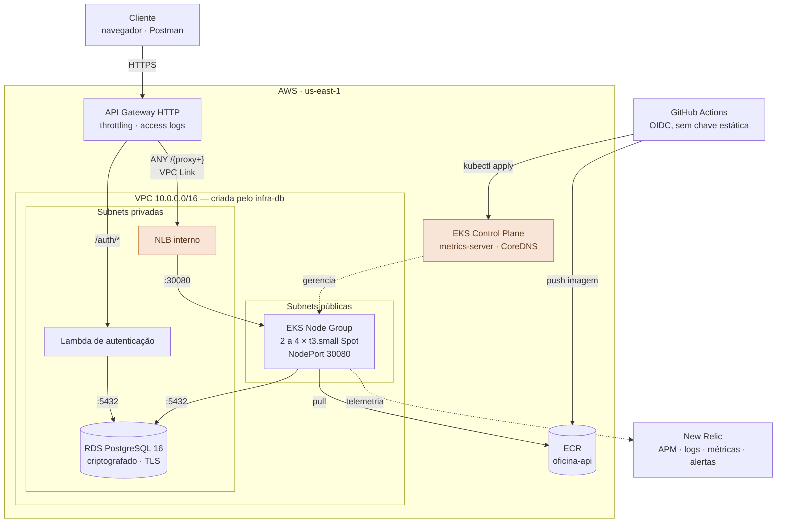
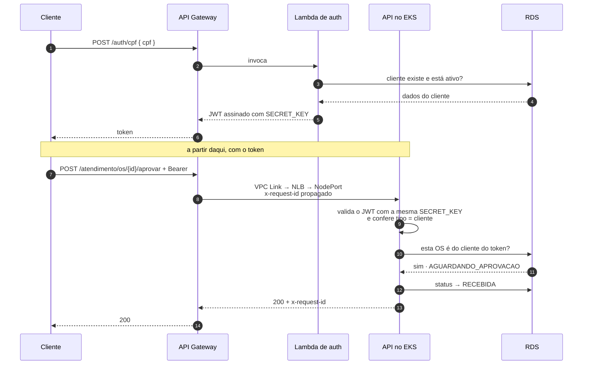

# tech-challenge-infra-k8s — Cluster, Gateway e Observabilidade

Terraform que provisiona o **cluster Amazon EKS**, o **API Gateway**, o **ECR**, a
**federação OIDC com o GitHub** e a integração com o **New Relic**.

> Pós-Tech Software Architecture · FIAP · Tech Challenge Fase 03

> ⚠️ **Este é o repositório que custa dinheiro.** O control plane do EKS cobra
> US$ 0,10/hora esteja ele ocupado ou ocioso. Use `make up` para trabalhar e
> **`make down` ao terminar**. Uma sessão de 3 horas sai por ~US$ 0,45; um mês
> esquecido no ar, por ~US$ 100.

---

## Os quatro repositórios

| Repositório | Responsabilidade |
|---|---|
| `tech-challenge-infra-db` | VPC, RDS PostgreSQL, Secrets Manager — **aplicar primeiro** |
| **tech-challenge-infra-k8s** ← você está aqui | EKS, ECR, API Gateway, OIDC, New Relic |
| `tech-challenge-auth-lambda` | Autenticação por CPF; cria a própria rota neste gateway |
| `tech-challenge-app` | API REST da oficina, implantada neste cluster |

---

## Arquitetura



Os blocos destacados são os que geram custo por hora.

### Fluxo de uma requisição autenticada



A `SECRET_KEY` que a Lambda usa para assinar e a que a API usa para validar são
**a mesma**, vinda do Secrets Manager criado no `infra-db`. Se divergirem, todo
token é rejeitado com erro genérico de credencial — vale conferir no primeiro teste.

---

## Decisões arquiteturais

### ADR-005 · O NLB é do Terraform, não do Kubernetes

**Contexto.** O caminho idiomático seria um `Service` do tipo `LoadBalancer`, deixando
o AWS Load Balancer Controller provisionar o NLB.

**Problema.** Isso cria uma dependência circular: o API Gateway precisa do ARN do
listener para configurar a integração, mas esse listener só existiria **depois** que a
aplicação fosse implantada — e a aplicação só é implantada depois que o cluster e o
gateway existem. Não há ordem de `apply` que resolva.

**Decisão.** O Terraform é dono do NLB de ponta a ponta. O alvo é o **grupo de auto
scaling dos nodes**, que existe assim que o cluster sobe. O `Service` da aplicação vira
`NodePort` numa porta fixa, e o `kube-proxy` encaminha do node para o pod.

**Consequência.** A porta **30080** é contrato entre este repositório e o
`tech-challenge-app`. Em troca,
todo o caminho de rede é determinístico e provisionado por IaC — o que o desafio valoriza.

**Alternativa para um cenário real:** AWS Load Balancer Controller com Ingress, criando
a integração do gateway num segundo `apply`. Mais idiomático, porém com duas etapas.

---

### ADR-006 · Nodes em Spot com múltiplos tipos de instância

**Decisão.** `capacity_type = "SPOT"` com dois tipos aceitos, `t3.small` e `t3a.small`.

**Motivo.** Spot custa ~70% menos. O risco é a interrupção com dois minutos de aviso —
mitigado por aceitar vários tipos (mais chance de encontrar capacidade) e manter no
mínimo dois nodes, com `PodDisruptionBudget` do lado da aplicação.

**Consequência.** Ambiente de demonstração pode perder um node no meio de uma sessão.
Para produção real, um node group On-Demand para cargas críticas e Spot para o resto.

---

### ADR-007 · Autenticação do CI por OIDC, sem chave estática

**Decisão.** O GitHub Actions assume uma role IAM apresentando um token OIDC assinado
pelo próprio GitHub. Nenhuma `AWS_ACCESS_KEY_ID` é guardada como secret.

**Motivo.** Chave estática não expira, não rotaciona sozinha e vaza em log com
facilidade. O token OIDC vale minutos e é emitido por execução.

**Detalhe que costuma falhar.** A condição de confiança restringe por `sub`:
`repo:<org>/<repo>:*`. Sem ela, **qualquer repositório do GitHub** poderia assumir a
role. Os quatro repositórios autorizados estão em `var.repos_github`.

**Segunda armadilha.** Autenticar na AWS não basta para falar com o cluster: o EKS
separa autenticação de autorização. Por isso existem `aws_eks_access_entry` e
`aws_eks_access_policy_association` — sem eles o pipeline recebe `Unauthorized`
mesmo com credenciais válidas.

**Permissões.** A role tem `AdministratorAccess`, porque três dos quatro pipelines rodam
Terraform e criam VPC, RDS, EKS, IAM e Lambda. O limite é a confiança: só os quatro
repositórios do dono assumem a role, e só por OIDC. Em produção, uma role por pipeline,
com privilégio mínimo.

---

### ADR-008 · Uso de HPA e o metrics-server como pré-requisito

**Decisão.** O `metrics-server` é instalado como addon gerenciado do EKS.

**Motivo.** O HPA declarado na aplicação (2 a 6 réplicas, 70% de CPU) só funciona se
alguém publicar métricas de consumo na API do Kubernetes. Sem o metrics-server, o HPA
fica em `<unknown>/70%` e **nunca escala** — e a escalabilidade que o desafio pede
deixa de ser demonstrável.

**Consequência.** O teto do node group (4 nodes) precisa comportar o teto do HPA
(6 réplicas). Com 6 pods de 192Mi de request, dois `t3.small` já dão conta; o teto
existe como folga.

---

### ADR-013 · Ambiente efêmero, com uma chave de estado no GitHub

**Contexto.** O ambiente AWS só existe durante sessões de trabalho, porque o control plane
cobra por hora. A role OIDC que os quatro pipelines assumem nasce e morre com este cluster.
Com o ambiente desligado — o estado normal —, todo job que tentasse autenticar falharia:
pipelines vermelhos justamente quando alguém os abre para avaliar. E um merge na `main` deste
repositório poderia religar a cobrança sem ninguém perceber.

**Decisão.** Uma variável de repositório, `AMBIENTE_ATIVO`, nos quatro repositórios. O que não
precisa de AWS roda sempre: testes, validação, build e boot da imagem, empacotamento da
Lambda. O que precisa só roda com a variável em `true`; desligada, esses jobs aparecem como
pulados, com o motivo no resumo da execução. `make up` liga a variável ao final;
`make down` a desliga **antes** de destruir.

**Alternativas rejeitadas.**
- *Base persistente*, com role e ECR num estado separado que não é destruído a cada sessão:
  mantém recursos na conta entre sessões.
- *Chave de acesso de um usuário IAM* guardada no GitHub: credencial permanente e sem
  expiração, exatamente o que o ADR-007 rejeita.
- *Apply só por acionamento manual*: enfraquece o deploy automático e, sozinho, não resolve
  a autenticação.

**Consequências.**
- Entre sessões, só o bucket do estado sobrevive — e `make bootstrap-destroy`, no
  `tech-challenge-infra-db`, o apaga ao fim da entrega.
- Com a variável desligada, PRs de infraestrutura têm validação, mas não `plan`.
- Falha real de autenticação com a variável em `true` continua vermelha, com mensagem que
  explica as causas prováveis. A chave não mascara erro.
- Como a role só existe enquanto o cluster existe, **nenhum pipeline consegue recriar o
  cluster do zero** — só alterar um que já está no ar. Ligar cobrança é sempre uma ação humana.

---

## O que é criado

| Recurso | Detalhe |
|---|---|
| EKS Cluster | Kubernetes 1.36, logs de API e auditoria por 7 dias |
| Node Group | 2 a 4 × `t3.small` Spot, subnets públicas |
| Addons | `vpc-cni`, `kube-proxy`, `coredns`, `metrics-server` |
| ECR | `oficina-api`, varredura no push, retenção das 10 últimas imagens |
| NLB interno | Alvo: grupo de auto scaling dos nodes na porta 30080 |
| API Gateway HTTP | Rota coringa para o cluster, throttling, access logs em JSON |
| VPC Link | Ligação privada entre o gateway e o NLB |
| OIDC + Role | `AdministratorAccess`, restrita por OIDC aos quatro repositórios |
| Launch template | Coloca os nodes no grupo `cliente-db`, o único que o RDS aceita |
| New Relic | `nri-bundle` via Helm — infraestrutura, eventos, logs e Prometheus |

---

## Como usar

> **Montando tudo do zero?** Siga o roteiro completo no README do `tech-challenge-infra-db`,
> seção *Do zero numa conta nova*. Esta seção cobre só este repositório.

### Pré-requisitos

1. **O `tech-challenge-infra-db` aplicado nesta conta.** O `make up` confere e recusa sem ele.
2. **`AWS_PROFILE` apontando para a conta:** `export AWS_PROFILE=seu-perfil`.
3. **`gh` autenticado**, com os quatro repositórios no seu GitHub.

### Subir

```bash
make github-segredos   # uma vez: AWS_ROLE_ARN nos 4 repositórios — o ARN não muda entre sessões
make up                # ~15 min · a cobrança começa aqui · liga AMBIENTE_ATIVO no final
make implantar         # aciona os pipelines da Lambda e da API
make output            # url_api e url_swagger
```

O dono dos repositórios é lido do remote `origin` e restringe quais repositórios podem
assumir a role de deploy. Para outro dono: `make up GITHUB_OWNER=seu-usuario`.

### Operar

```bash
make status            # nodes, pods, services e HPA
make ambiente-status   # AMBIENTE_ATIVO em cada repositório
make kubeconfig        # aponta o kubectl para o cluster
make custo             # o que está pesando agora
```

### Derrubar

```bash
make down              # desliga AMBIENTE_ATIVO, destrói · ~10 min · encerra a cobrança
```

O `down` recusa enquanto a Lambda existir: destrua o `tech-challenge-auth-lambda` antes.
Depois deste, o `tech-challenge-infra-db`.

---

## Contrato publicado

Consumido pelo `auth-lambda` e pelos pipelines:

| Parâmetro | Conteúdo |
|---|---|
| `/tech-challenge/cluster/nome` | Nome do cluster EKS |
| `/tech-challenge/apigateway/id` | ID da API — o `auth-lambda` cria sua rota nela |
| `/tech-challenge/apigateway/endpoint` | URL pública da API |
| `/tech-challenge/apigateway/execucao_arn` | ARN de execução, para a permissão da Lambda |

---

## Custo

| Recurso | Por hora | Observação |
|---|---|---|
| EKS control plane | US$ 0,100 | sem free tier; só em versão com suporte padrão — no estendido, US$ 0,60 |
| 2 × t3.small Spot | US$ 0,014 | ~70% de desconto |
| NLB interno | US$ 0,0225 | + custo por LCU processada |
| EBS dos nodes | US$ 0,004 | |
| API Gateway | ~US$ 0 | US$ 1,00 por milhão de requisições |
| ECR | ~US$ 0 | 500 MB grátis; a política de retenção segura o resto |
| **Total** | **~US$ 0,14/h** | ~US$ 3,40/dia · ~US$ 100/mês |

Configure um **AWS Budget** com alerta em US$ 5 e US$ 20. Todo recurso leva a tag
`Project=tech-challenge`, então o Cost Explorer isola esse gasto.

---

## Observabilidade

O `nri-bundle` cobre o lado do cluster: CPU e memória de nodes e pods, estado dos
objetos (deployments, HPA, réplicas), eventos e coleta do stdout — que a aplicação já
emite em JSON com `correlation_id`, então chega ao New Relic indexado campo a campo.

A instrumentação da aplicação (APM, latência, traces) **não** vem daqui: é o agente
Python dentro da imagem, ligado pelo `entrypoint.sh` quando há licença configurada.

O access log do API Gateway registra `requestId`, latência e erro de integração — e o
`requestId` é propagado para a aplicação como `x-request-id`, costurando o log do
gateway ao log do pod.

**Variável necessária:** `newrelic_license_key` (ou o secret `NEW_RELIC_LICENSE_KEY`
no CI). Vazia, nada é instalado e o cluster sobe normalmente.

---

## CI/CD

| Evento | `AMBIENTE_ATIVO` | O que acontece |
|---|---|---|
| Pull Request | qualquer | `fmt` e `validate` |
| Pull Request | `true` | acima, mais `plan` comentado no PR |
| push em `main` ou execução manual | `true` | `plan` e `apply` no cluster que está no ar |
| push em `main` ou execução manual | ausente ou `false` | só validação; plan e apply **pulados**, com o motivo no resumo |

**Ambiente efêmero.** O ambiente AWS só existe durante as sessões de trabalho (`make up` e
`make down` no `tech-challenge-infra-k8s`), e a variável de repositório `AMBIENTE_ATIVO` diz ao
pipeline em que estado ele está — ver ADR-013 acima. **Job pulado não é falha**:
é o comportamento esperado com o ambiente desligado. Já uma falha de autenticação com a
variável em `true` fica vermelha e explica no log as causas prováveis.

A `main` é protegida: infraestrutura muda apenas por Pull Request revisado.

| Configuração no repositório | Tipo | Quem grava |
|---|---|---|
| `AWS_ROLE_ARN` | secret | `make github-segredos`, no `tech-challenge-infra-k8s` |
| `AMBIENTE_ATIVO` | variável | `make up` e `make down`, no `tech-challenge-infra-k8s` |
| `NEW_RELIC_LICENSE_KEY` | secret | `make github-segredos`, se a chave estiver exportada |

O primeiro `apply` é sempre local (`make up`): a role que o pipeline assume nasce aqui.

---

## Stack

Terraform 1.10+ · AWS Provider 5.x · Amazon EKS 1.36 · Amazon ECR ·
API Gateway HTTP API · Network Load Balancer · IAM OIDC · Helm · New Relic ·
GitHub Actions
